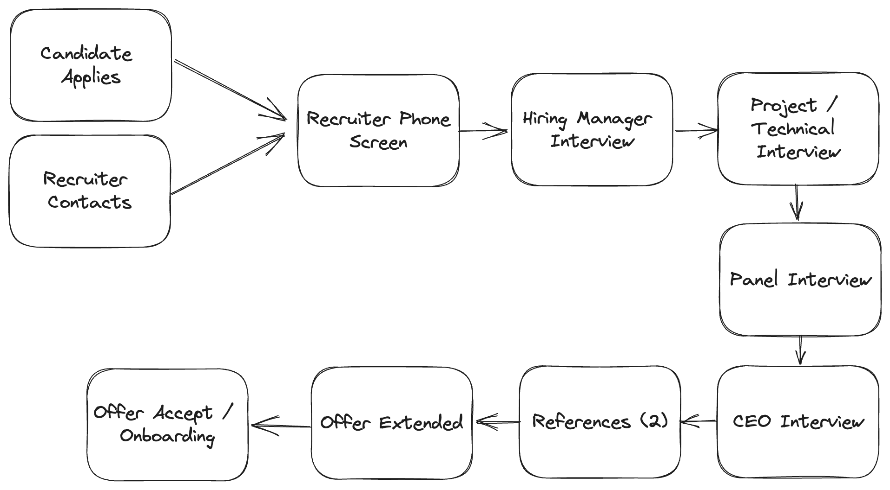

# Open Sourced Interview Process

- [Getting Started](#getting-started)
- [Interview Process and Timeline](#interview-process-and-timeline)
- [For Candidates - Applying to Whop](#for-candidates---applying-to-cockroach-labs)
- [For Recruiters - Resources](#for-recruiters---resources)
- [Challenging Our Unconcious Bias](#challenging-our-unconscious-bias)
- [Exercise Based Interview Questions](#exercise-based-interview-questions)
- [Contributing to the Interview Process Guide](#contributing-to-the-interview-process-guide)
- [Life After the Interview](#life-after-the-interview)

## Welcome to the Whop Interview Process
At Whop, we are exploring new ways to structure our interview process to create familiarity for candidates and account for bias, resulting in a better candidate experience and hiring decisions. Instead of asking questions based on past performance or hypothetical future situations, we focus on assessing the skills you’ll use in your role with exercise based interviews. 

**Why are we open sourcing the interview process?**

- **To help candidates feel prepared:** If you spend the time to research Whop and our interview process, we will be thrilled.  We think that if candidates spend the time to prepare for engaging discussions with the team, they will be ready to do the same when they join the team! 

## Getting Started

The following content will provide candidates, recruiters, hiring managers with valuable information. 

**For Candidates:**

- You will leave with a thorough understanding of the interview process at Whop, along with visibility into real questions from our interviews. Our recruiters will provide you with interview preparation specific to your role throughout the recruiting process.

- Throughout your time interviewing, we encourage you to share your thought process with your interviewers. Discussing *why* and *how* you developed a solution will put your creativity and approach to problem-solving on display!

**For Hiring Managers:**

- You will have a clearly defined process to follow when requesting a new job.

- Following a structured process will lead to better hires.

## Interview Process and Timeline

#### Overview

We aim to have our interview process completed in as timely a fashion as possible, but at any point during the interview process, please feel comfortable reaching out to us for updates on your candidacy. 

1A. **Candidate Application:** Applicants receive an automated message from the Applicant Tracking System (in this case, [Greenhouse](https://www.greenhouse.io)) to confirm receipt of their application. The note thanks them for submitting their information and contains a Whop Company Guide that gives applicants an inside look into the company culture.

1B. **Recruiter Contact:** We may have reached out to you directly with interest in working together! 

2. **Candidate Application Review:** The recruiter for the position will do the first round of evaluations and review application submissions. If more information is required, a member of the team will reach out to the applicant directly. Candidates that are disqualified at this stage will be notified via Greenhouse.

3. **Recruiter Phone Screen:** If the candidate qualifies for the role, the recruiter will send an availability request for a 30-minute call to explore their background, and experience as well as covering logistics. Depending on the outcome of the screening call, the candidate will either be rejected or proceed to a 30 minute video interview with the hiring manager.

3. **Hiring Manager Phone Screen:** If moved forward the recruiter will send an availability request for a 30-minute call to explore their background and experience. Depending on the outcome of the screening call, the candidate will either be rejected or proceed to a take-home exercise or a technical video interview.

4. **Take-home Exercise and/or Phone Interview**

    - **Take-home Exercise:** The take-home exercise typically takes 1-2 hours to complete and allows the hiring manager or a member of the team to review a candidate’s skills before proceeding to the next step of the hiring process. The take-home exercise replaces one onsite interview, equaling one hour of engagement.  

    - **Technical Interview:** The 1-hour phone interview with a member of the team covers skills related to the specific role or to review the take-home exercise. For technical video interviews, we use Google Meet and cover coding and debugging, tech stack knowledge, and technical problem solving.

5. **Panel Interviews:** The next step in the interview process is a panel interview. It consists of three twenty minute interviews in one hour long period. Interviewers include people that would be on the candidate's direct team and people on cross-functional teams, too. The recruiter will share an overview of the team members with whom the candidate will be meeting.

6. **CEO Interview:** The final step in the interview process is an interview with Steven, Whop's CEO. It consists of a thirty minute video call covering your experience, fit to the business needs, and overall long term alignment.

7. **Candidate Survey:** Once the candidate finished the panel interview, the recruiter will send the candidate a link to complete our candidate survey. By filling out this short 2-minute survey, candidates help us iterate on our interview process.

8. **Hiring Committee Review:** After the panel interview is complete, feedback from the interview process is shared across the interview team. The hiring manager and CEO and reach a decision of hire/no-hire based on the comprehensive feedback. If moving forward recruiter will proceed with references otherwise feedback is shared with the candidate.

9. **Reference Calls:** The recruiting team will make reference calls for promising candidates. At a minimum, two reference calls will be completed.  One should be a candidate's manager and the other someone who has worked directly with the candidate and can speak to their past work. 

10 **Final Review:** After successful reference calls, the recruiter submits the employee packet to the CEO and Hiring Manager for final approval.

11. **Offer Extend:** The recruiter will reach out to the candidate to schedule time to connect and extend the formal offer. Initially, this is done verbally but is always followed by the written offer as described in the section on preparing offers. The Hiring Manager and interview team follows-up to answer any questions that the candidate may have, which will hopefully lead to the candidate accepting the offer. While we would love to know whether or not you'd like to accept an offer from us in 3 days as well, we are happy to extend offer deadlines up to one week, so that you can make the best decision for you and your family. 

11. **Offer Accept/Onboarding:** If the candidate accepts the offer, the onboarding process begins. 

## For Candidates - Applying to Whop

The best way to apply for positions with Whop is directly through our careers page, where we list all of our open roles.

To apply to Whop:

1. Go to our [careers page](https://www.careers.whop.com/).

2. Click on the team you'd like to join, choose the job you'd like to do, and review the description of the role.

3. If the role sounds interesting to you, fill out the application form at the bottom of the page, then click the "Submit Application" button.  

## For Recruiters - Resources

These files provide a deep-dive into the various stages of the interview process. It is important that recruiters tailor each stage to the position they are hiring for. Stages included: 

- [Job Descriptions](JobDescriptions.md)

- [Recruiter Phone Screen](RecruiterPhoneScreen.md)

- [Structuring the Interview](StructuringtheInterview.md)

- [Interview Feedback and Scoring](InterviewFeedbackandScoring.md)

- [Rejecting Applicants](RejectingApplicants.md)

- [Candidate Feedback Survey](CandidateFeedbackSurvey.md)

## Challenging our Unconscious Bias

In the effort of building a diverse workforce, at Cockroach Labs, we ask the question: "are we missing strong candidates because of preconceptions or unconscious biases of the interviewer?" To challenge our bias, we have committed to:

1. Exercise based interviewing

2. Removing resumes

3. Expectations based job descriptions

Our hypothesis is that a structured and fair process means better decisions. We understand that it is impossible to eliminate all biases, so we want to make sure that we are aware of them and challenge them in whatever ways we can.

## Exercise Based Interview Questions

The purpose of an interview is to obtain information about a candidate in order to predict future performance. To accomplish this, we rely on Exercise-Based Interviewing. Exercise-based interviews can include case studies, group exercises involving role play or discussions, individual exercises, or presentations. They allow for our interviewers to witness the direct application of a candidate’s abilities to competencies required for the role. Rather than guess if a candidate can do the job based on their answers to behavioral questions, we ask for candidates to show. During the interview, candidates are asked to complete exercises that are similar to the initiatives they would complete when actually working in the position on a day to day basis.

For engineering positions, we use coding and system design questions. For non-tech, we use job-based simulations in the form of case studies, individual exercises, and/or presentations.

For more information about the different exercises we use in our interview process, please review the different department areas. 

- [Administrative Exercises](AdministrativeExercises.md)

- [Documentation Exercises](DocumentationExercises.md)

- [Engineering Exercises](EngineeringExercises.md)

- [Human Resources Exercises](HumanResourcesExercises.md)

- [Marketing Exercises](MarketingExercises.md)

- [Product Exercises](ProductExercises.md)

- [Product Design Exercises](ProductDesignExercises.md)

- [Recruiting Exercises](RecruitingExercises.md)

- [Sales Exercises](SalesExercises.md)

- [Technical Support Exercises](TechnicalSupportExercises.md)

## Contributing to the Interview Process Guide

If you’d like to contribute an interview exercise, please follow the template below, then either submit a pull request on the correct file for the departments listed or email it to recruiting@cockroachlabs.com to be added to the file. Please note, if the department file does not exist, email recruiting@cockroachlabs.com so that we can create it for you. 

**Interview Exercise Template:** 

**Title:** 

- **Overview:** 

- **Set-up:** 

- **Part 1:** 

- **Part 2:** 

- **Considerations:** 

- **Follow-up Question:** 

- **Prompts (if any)**

- **[Not included] Curveball Question:** The curveball portion should be an extension of the interview that shows how the candidate thinks on their feet. This portion is not shared with candidates as we want to evaluate how they respond to a problem to find a solution.

## Life After the Interview

We believe that setting you up for success does not end with the hiring process— our commitment to ensuring that you are well-prepared to join our team is the cornerstone of our onboarding program. If you would like to explore what onboarding and your first few months at Cockroach Labs might look like, feel free to browse our documentation.

- [Your First Weeks at Cockroach Labs](firstweeks.md)
- [What to Expect: Engineering Interns](CRLInternship.md)
